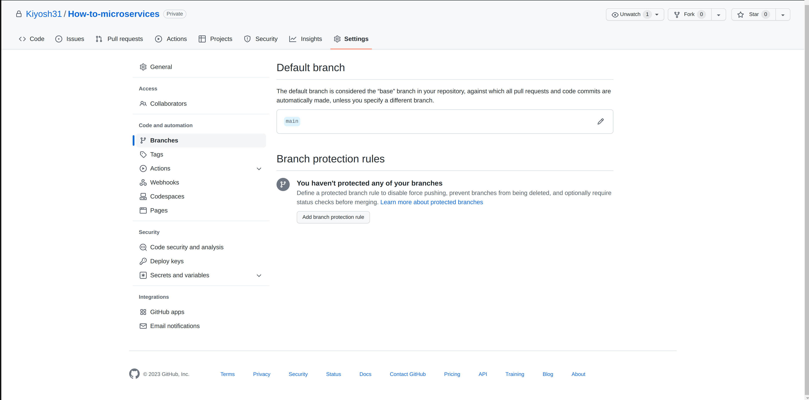

# Introduction

Usually in real projects we **DO NOT** push directly to master branch since this branch is usually the branch that deploys to some kind of `production environment`, so for this we need to setup branch protection to avoid mistakes from devs or other organization member

# Instructions

In github web page, go to your `Repository -> settings -> Branches` then click in `Branch protection rules -> Add branch protection rule` like in image

Then you should put a name in `branch name pattern` and select options:

- Require a pull request before merging
- Require approvals
  - select at least 2
- Require status checks to pass before merging
  - Require branches to be up to date before merging
    - Build(16x)
- Require linear history

Finally click on `Create`
